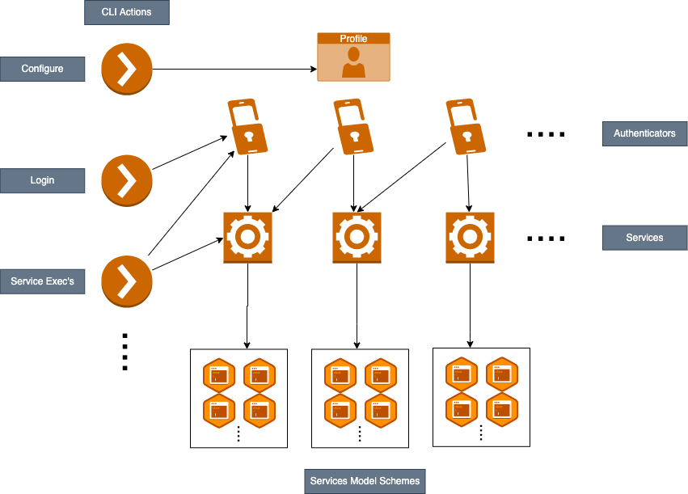

# Architecture

The library is designed as follows:

{: style="height:100%;width:100%"}

## Design Perspectives
The main components are:

- <b>Profile</b>: The profile defines a set of properties and information about the user's authentication methods. Profiles are persisted on the filesystem for subsequent actions.
- <b>Authenticators</b>: The integrations with specific authentication methods, which enable interaction with services. An authentication method can either be Identity (User/Service User) or a custom implementation.
- <b>Services</b>: The service providing functionality (requires one or more associated authenticators to perform actions). For example, the audit service exposes audit APIs in an secure manner.
- <b>Services Model Schemes</b> The models exposed by a service, which can be used to perform the service's actions.
- <b>CLI Actions</b>: CLI interface built on the SDK, which provides users with the following shell commands:
    - `login`: Log in to a profile authenticator
    - `exec`: Execute services actions
